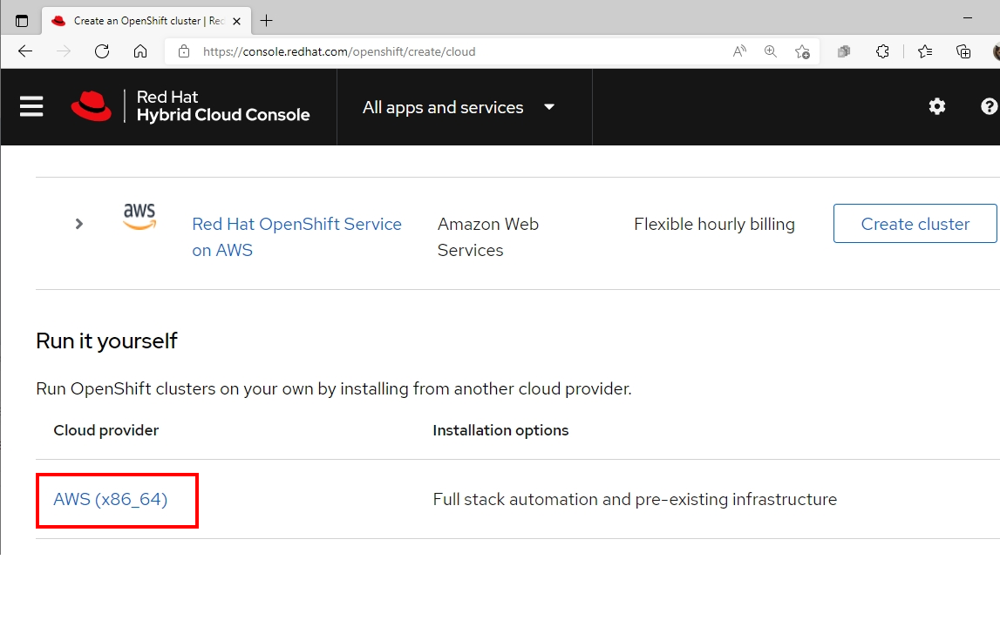
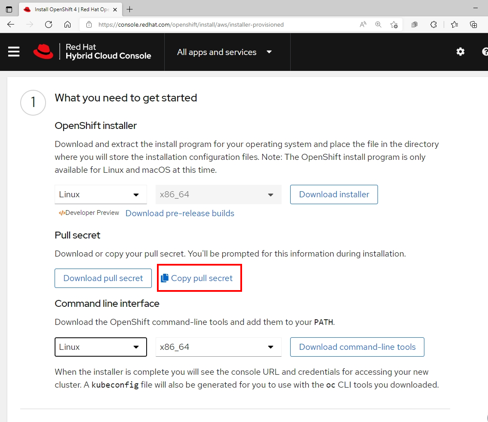

# Installation on AWS

- [Installation on AWS](#installation-on-aws)
  - [Prerequisites](#prerequisites)
  - [Preparation](#preparation)
  - [Install OpenShift](#install-openshift)
  - [OpenShift Architecture](#openshift-architecture)

## Prerequisites

- Public Hosted Zone and map to DNS in Route 53 service
- AWS Account with Programmatic Acesss and AdministratorAccess Policy included 
- Access Key ID of AWS Account
- Secret Access Key Values of AWS Account
- AWS Public regions for deploy Openshift Cluster
- Pull secret from [https://cloud.redhat.com](https://cloud.redhat.com)
  - Evaluation subscription can be found at [try.openshift.com](https://try.openshift.com)
- Internet Access during installation process
- Generating a Key Pair for cluster node with SSH Access

Default CPU , memory and Disk sizing for Openshift node after finish deployment

| Node Type   | vCPU | Mem(GiB) | Storage (GB) |
|-------------|:------:|:----------:|:--------------:|
|Control Plane | 4    | 16       | 100          | 
|Compute | 2    | 8        | 100          |


## Preparation

prepare the bastion server to install OpenShift Container Platform. This includes installing the AWS Command Line Interface , the OpenShift Installer , and the OpenShift CLI

- Connect to your administration host
  
  ```bash
  ssh <user name>@bastion.<Domain Name>
  ```

- Switch to *root* using the *sudo* command
  
  ```bash
  sudo -i
  ```

- Install the AWS CLI Tool
  

  ```bash
    curl "https:/s3.amazonaws.com/aws-cli/awscli-bundle.zip" -o "awscli-bundle.zip"
    unzip awscli-bundle.zip
    ./awscli-bundle/install -i /usr/local/aws -b /bin/aws
    aws --version
  ```

- Install OpenShift CLI Tools
  - Download OpenShift Installer and OpenShift Client (oc) from [here](https://mirror.openshift.com/pub/openshift-v4/clients/ocp/latest/)
  - Install OpenShift Installer 
    
    ```
    tar zxvf <OpenShift-Installer> -C /usr/bin
    chmod +x /usr/bin/openshift-install
    ```
  - Install OpenShift Client (oc)
  
    ```bash
    tar zxvf <OpenShift Client> -C /usr/bin
    chmod +x /usr/bin/oc
    ```

  - Optional: setup bash completion

    ```bash
    openshift-install completion bash >/etc/bash_completion.d/openshift-install
    oc completion bash >/etc/bash_completion.d/openshift
    ```

- Set your AWS credentials to **$HOME/.aws/credentials** 

## Install OpenShift

- Get pull secret from [cloud.redhat.com](https://cloud.redhat.com)
  - Login to [cloud.redhat.com](https://cloud.redhat.com)
    
    

  - Navigate to OpenShift Menu->Create Cluster->Run it yourself->AWS (x86_64) on run it your self->Installer-provisioned-infrastructure
  
    
  - Copy pull secret
    
    

  - Save your pull secret for use later

-  Create an SSH keypair to be used for your Openshift environement

    ```bash
    ssh-keygen -f ~/.ssh/cluster-{Name}-key -N ''
    ```
- Run OpenShift Installer for interactive installation

  ```bash
  openshift-install create cluster --dir <installation_directory>
  ```
  
- Input your cluster configuration

  ```bash 
    ? SSH Public Key /home/<user_name>/.ssh/cluster-{Name}-key.pub
    ? Platform aws
    INFO Credentials loaded from the "default" profile in file "/home/<user_name>/.aws/credentials"
    ? Region <your AWS Region>
    ? Base Domain <your AWS Domain>
    ? Cluster Name <your AWS Cluster Name>
    ? Pull Secret [? for help] 
    ***************************************************************************************************************************************************************
  ```

  Sample output

  ```log
    INFO Creating infrastructure resources...
    INFO Waiting up to 20m0s for the Kubernetes API at https://api.cluster-e9eb.sandbox1409.opentlc.com:6443...
    INFO API v1.19.0+e49167a up
    INFO Waiting up to 30m0s for bootstrapping to complete...
    INFO Destroying the bootstrap resources...
    INFO Waiting up to 40m0s for the cluster at https://api.cluster-e9eb.sandbox1409.opentlc.com:6443 to initialize...
    INFO Waiting up to 10m0s for the openshift-console route to be created...
    INFO Install complete!
    INFO To access the cluster as the system:admin user when using 'oc', run 'export KUBECONFIG=/home/wkulhane-redhat.com/cluster-e9eb/auth/kubeconfig'
    INFO Access the OpenShift web-console here: https://console-openshift-console.apps.cluster-e9eb.sandbox1409.opentlc.com
    INFO Login to the console with user: kubeadmin, password: ***************
    INFO Time elapsed: 32m6s
  ``` 
- set up the OpenShift CLI
  
  ```bash
  export KUBECONFIG=$HOME/cluster-{NAME}/auth/kubeconfig
  echo "export KUBECONFIG=$HOME/cluster-{NAME}/auth/kubeconfig" >>$HOME/.bashrc
  ```
- Validate your clusters
  - Check that you are cluster administrator
    
    ```bash
    oc whoami
    ```

    Output
    
    ```bash
    system:admin
    ```
  - Validate that all nodes have a status of **Ready**
    
    ```bash
    oc get nodes
    ```
    
    Output
    
    ```bash
    NAME                                         STATUS   ROLES    AGE   VERSION
    ip-10-0-132-239.us-east-2.compute.internal   Ready    master   24m   v1.19.0+e49167a
    ip-10-0-147-206.us-east-2.compute.internal   Ready    worker   17m   v1.19.0+e49167a
    ip-10-0-169-195.us-east-2.compute.internal   Ready    worker   19m   v1.19.0+e49167a
    ip-10-0-184-201.us-east-2.compute.internal   Ready    master   24m   v1.19.0+e49167a
    ip-10-0-200-125.us-east-2.compute.internal   Ready    worker   19m   v1.19.0+e49167a
    ip-10-0-212-189.us-east-2.compute.internal   Ready    master   24m   v1.19.0+e49167a
    ```

## OpenShift Architecture


