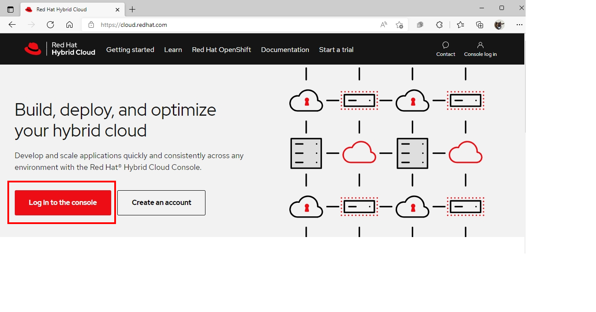
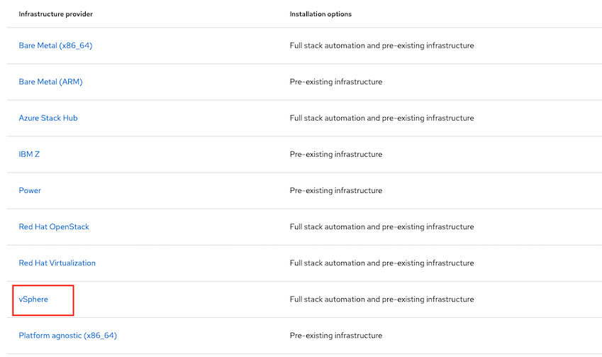
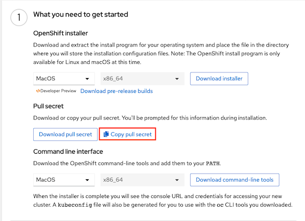

# Installation on vSphere

- [Installation on vSphere](#installation-on-vsphere)
  - [Prerequisites](#prerequisites)
  - [Preparation](#preparation)
  - [Install OpenShift](#install-openshift)
  - [OpenShift Architecture](#openshift-architecture)

## Prerequisites

Prepare below before deploy OpenShift Cluster
- Recommended vSphere version
  - VM hardware version 15 or later
  - vSphere version 6.7U3
- Requires to access to port 443 to vCenter and all ESXi hosts
  - [vSphere infrastructure requirements](https://docs.openshift.com/container-platform/latest/installing/installing_vsphere/installing-vsphere-installer-provisioned.html#installation-vsphere-infrastructure_installing-vsphere-installer-provisioned)
  - [vCenter requirements](https://docs.openshift.com/container-platform/latest/installing/installing_vsphere/installing-vsphere-installer-provisioned.html#installation-vsphere-installer-infra-requirements_installing-vsphere-installer-provisioned)
- Global Administrative privileges account of vCenter
  - [Required vCenter account privileges](https://docs.openshift.com/container-platform/latest/installing/installing_vsphere/installing-vsphere-installer-provisioned.html#installation-vsphere-installer-infra-requirements_installing-vsphere-installer-provisioned)
- 856 GB space on Storage
- 2 IP Addresses for API and Ingress
- DNS records for two static IP addresses (API and Ingress IP Address)
- DHCP Server
- vCenter root CA  to trust installation host with vCenter before deploy OpenShift
- Pull secret from [https://cloud.redhat.com](https://cloud.redhat.com)
  - Evaluation subscription can be found at [try.openshift.com](https://try.openshift.com)
- Internet Access during installation process
- Generating a Key Pair for cluster node with SSH Access
- Download the OpenShift Command-line tools and Openshift installer  


Default CPU , Memory and Disk sizing for Openshift node after finish deployment**

| Node Type   | vCPU | Mem(GiB) | Storage (GB) | IOPS|
|-------------|:------:|:----------:|:--------------:|:------:|
|Control Plane | 4    | 16       | 100          | 300
|Compute | 2    | 8        | 100          |300


## Preparation

prepare the bastion node to install OpenShift Container Platform. This includes installing the AWS Command Line Interface , the OpenShift Installer , and the OpenShift CLI

- Connect to your administration host
  
  ```bash
  ssh <user name>@bastion.<Domain Name>
  ```

- Switch to ``root`` using the ``sudo`` command
> **`sudo -i`**

- Switch to *root* using the *sudo* command
  
  ```bash
  sudo -i  
  ```

- Install OpenShift CLI Tools
  
  - Download OpenShift Installer and OpenShift Client (oc) from [here](https://mirror.openshift.com/pub/openshift-v4/clients/ocp/latest/)
  - Install OpenShift Installer 
    
    ```
    tar zxvf <OpenShift-Installer> -C /usr/bin
    chmod +x /usr/bin/openshift-install
    ```
  - Install OpenShift Client (oc)
  
    ```bash
    tar zxvf <OpenShift Client> -C /usr/bin
    chmod +x /usr/bin/oc
    ```

  - Optional: setup bash completion

    ```bash
    openshift-install completion bash >/etc/bash_completion.d/openshift-install
    oc completion bash >/etc/bash_completion.d/openshift
    ```
## Install OpenShift

- Get pull secret from [cloud.redhat.com](https://cloud.redhat.com)
  - Login to [cloud.redhat.com](https://cloud.redhat.com)
    
    

  - Navigate to OpenShift Menu->Cluster->Select tab Datacenter->vSphere ->Installer-provisioned-infrastructure

    

  - Copy pull secret and you can also download CLI from here.
    
    

  - Save your pull secret for use later

-  Create an SSH keypair to be used for your Openshift environement

    ```bash
    ssh-keygen -f ~/.ssh/cluster-{Name}-key -N ''
    ```
- Run OpenShift Installer for interactive installation

  ```bash
  openshift-install create cluster --dir <installation_directory>
  ```
  
- Input your cluster configuration

  ```bash 
    ? SSH Public Key /home/<user_name>/.ssh/cluster-{Name}-key.pub
    ? Platform vsphere
    ? vCenter <vCenter's IP address>
    ? Username <Administrator Privileges account of vCenter>
    ? Password <Password of Administrator account>
    INFO Connecting to vCenter <vCenter's IP address>
    ? Datacenter <Data Center name for deploy OpenShift cluster>
    ? Default Datastore <Data Store for deploy OpenShift Cluster>
    ? Network <Network vlan id that same vlan with API and Ingress IP address>
    ? Virtual IP Address for API <API static IP Address>
    ? Virtual IP Address for Ingress <Ingress static IP Address>
    ? Base Domain <FQDN for OpenShift Cluster>
    ? Cluster Name <your OpenShift Cluster Name>
    ? Pull Secret [? for help] 
    ***************************************************************************************************************************************************************
  ```

  Output

  ```log
    INFO Creating infrastructure resources...
    INFO Waiting up to 20m0s for the Kubernetes API at https://api.cluster-e9eb.sandbox1409.opentlc.com:6443...
    INFO API v1.19.0+e49167a up
    INFO Waiting up to 30m0s for bootstrapping to complete...
    INFO Destroying the bootstrap resources...
    INFO Waiting up to 40m0s for the cluster at https://api.cluster-e9eb.sandbox1409.opentlc.com:6443 to initialize...
    INFO Waiting up to 10m0s for the openshift-console route to be created...
    INFO Install complete!
    INFO To access the cluster as the system:admin user when using 'oc', run 'export KUBECONFIG=/home/wkulhane-redhat.com/cluster-e9eb/auth/kubeconfig'
    INFO Access the OpenShift web-console here: https://console-openshift-console.apps.cluster-e9eb.sandbox1409.opentlc.com
    INFO Login to the console with user: kubeadmin, password: **********
    INFO Time elapsed: 32m6s
  ```
- set up the OpenShift CLI
  
  ```bash
  export KUBECONFIG=$HOME/cluster-{NAME}/auth/kubeconfig
  echo "export KUBECONFIG=$HOME/cluster-{NAME}/auth/kubeconfig" >>$HOME/.bashrc
  ```
- Validate your clusters
  - Check that you are cluster administrator
    
    ```bash
    oc whoami
    ```

    Output
    
    ```bash
    system:admin
    ```
  - Validate that all nodes have a status of **Ready**
    
    ```bash
    oc get nodes
    ```
    
    Output
    
    ```bash
    NAME                    STATUS    ROLES    AGE   VERSION
    vm-testvm-master-0       Ready    master   24m   v1.19.0+e49167a
    vm-testvm-worker-4dtqf   Ready    worker   17m   v1.19.0+e49167a
    vm-testvm-worker-lr8ll   Ready    worker   19m   v1.19.0+e49167a
    vm-testvm-master-1       Ready    master   24m   v1.19.0+e49167a
    vm-testvm-worker-t2j5v   Ready    worker   19m   v1.19.0+e49167a
    vm-testvm-master-2       Ready    master   24m   v1.19.0+e49167a
    ```
    
## OpenShift Architecture


